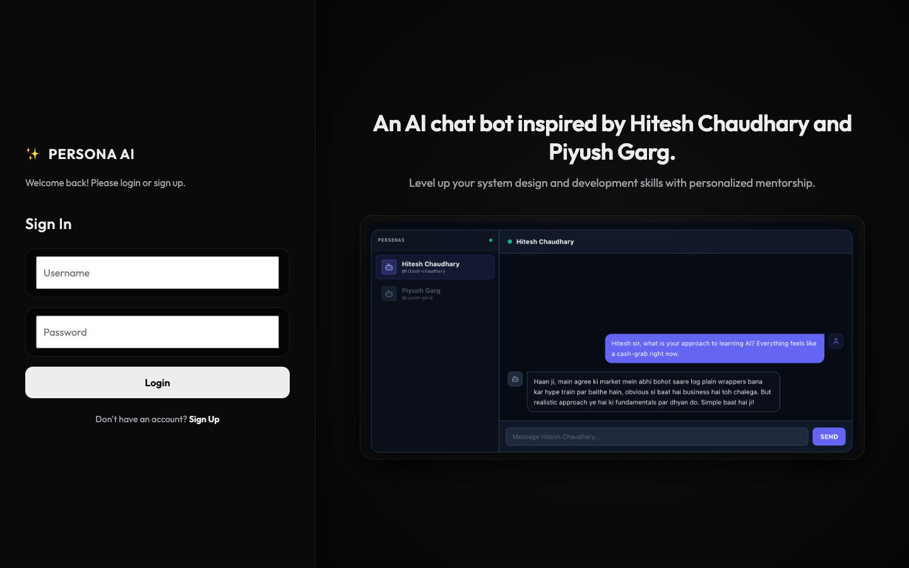
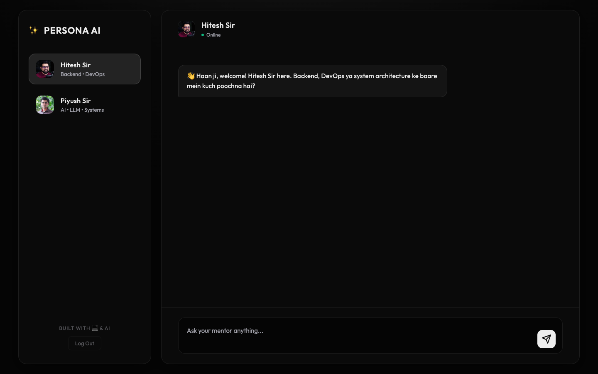

# ✨ PERSONA AI

A premium, interactive AI chatbot inspired by tech mentors **Hitesh Chaudhary** and **Piyush Garg**. 
This application provides personalized mentorship using customized AI Personas to help you level up your system design, backend development, and AI skills!

---

## 📸 Screenshots

### Landing & Authentication

*A sleek, split-screen auth layout featuring a modern dark aesthetic.*

### Persona Chat Interface

*Seamlessly switch between AI personas while maintaining individual chat states.*

---

## 🚀 Features

- **Multi-Persona Chat:** Seamlessly switch between different AI mentors (Hitesh Sir & Piyush Sir) without losing the context of your conversation.
- **Premium UI/UX:** A stunning, minimalist dark aesthetic utilizing glassmorphism, responsive layouts, and smooth animations.
- **Secure Authentication:** User sign-up and log-in system securely backed by MongoDB and password hashing (bcrypt).
- **Persistent Sessions:** JSON-based state handling integrated with `localStorage` to keep your chat secure and accessible.
- **Powered by OpenAI:** Leverages the robust `gpt-4o-mini` model to simulate accurate, persona-driven responses.

---

## 🛠️ Tech Stack

- **Frontend:** Vanilla JavaScript, HTML5, Vanilla CSS3 (Custom Design System)
- **Backend:** Node.js, Express.js
- **Database:** MongoDB Atlas, Mongoose
- **Security:** bcryptjs (Password Hashing)
- **AI Integration:** OpenAI API

---

## 💻 How to Run Locally

Follow these instructions to get the project up and running on your local machine.

### 1. Clone the repository
```bash
git clone https://github.com/Amitkhandelwal001/Gen-AI-chatbot.git
cd Gen-AI-chatbot
```

### 2. Install Dependencies
```bash
npm install
```

### 3. Setup Environment Variables
Create a `.env` file in the root of your project directory and add your secret keys.
*Note: Your `.env` file is ignored by Git, keeping your secrets safe.*

```env
# Your OpenAI API Key
OPENAI_API_KEY=sk-your-openai-key-here

# Your MongoDB Atlas Connection String
MONGO_URI=mongodb+srv://<username>:<password>@cluster0.mongodb.net/persona_ai?retryWrites=true&w=majority
```

### 4. Start the Development Server
```bash
npm run dev
```

### 5. Access the App
Open your browser and navigate to:
[http://localhost:3000](http://localhost:3000)

---

## 🤝 Contributing
Contributions, issues, and feature requests are welcome! Feel free to check the issues page if you want to contribute.

## 📝 License
Built with 💻 